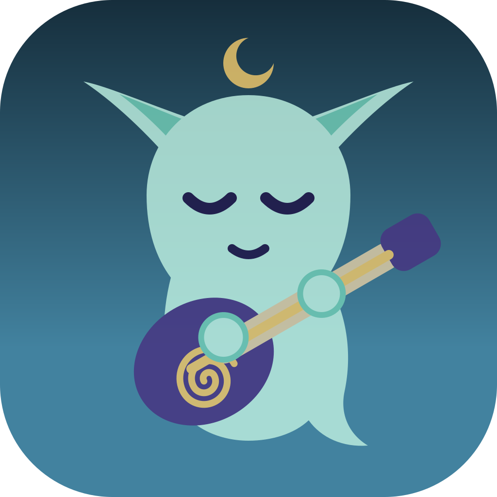

<p align="center">
  
</p>

# Bòcan Music

[](https://github.com/bocan/bocan-music/actions/workflows/pr.yml)
[](https://github.com/bocan/bocan-music/releases)
[](LICENSE)


[](https://swift.org)


**The music player macOS deserves.** No Electron. No Catalyst. No subscription. No cloud. Just your music, played beautifully.


---

## Why Bòcan?

Most Mac music players are either abandoned, Electron-wrapped, or stripped-down streaming clients that barely tolerate local files. Bòcan is the answer to all three: a **native Swift 6 app** built entirely around owning and enjoying your own library, the way iTunes used to be before it became a content storefront.

### 🔊 It sounds better

- **True gapless playback** with nanosecond `AVAudioTime` anchoring. Classical transitions, live albums, and DJ mixes play as the artist intended, with zero silence and zero clicks.
- **10-band graphic EQ**, bass boost, stereo expander, binaural crossfeed, and a **peak limiter**, a full DSP chain between your files and your ears.
- **ReplayGain** applied at playback time; analyses missing tags in the background using EBU R128 loudness.
- **Configurable crossfade** (0–12 s), **playback speed** (0.5×–2.0×) with pitch correction, and a **sleep timer** that fades gracefully rather than cutting mid-note.

### 📻 It plays everything

- Everything AVFoundation handles natively: **FLAC, ALAC, AAC, MP3, WAV, AIFF, CAF, M4A**.
- The awkward ones too, via an integrated FFmpeg bridge: **Ogg Vorbis, Opus, APE (Monkey's Audio), WavPack, DSD**. No plug-ins, no extra installs.
- **CUE sheets as chapter markers.** A single-file album rip keeps its track list: Previous and Next jump between cue points, the progress bar shows a tick at each boundary, and the player bar names the current cue's title and performer. Sheets attach automatically during scans, and a Markers tab in Get Info lists every cue point.

### 📚 It respects your library

- **Folder-based, non-destructive.** Point it at your music directory and it indexes without touching a single file.
- **Live FSEvents watcher** picks up new or changed files automatically; **mtime + fingerprint deduplication** keeps your library clean.
- **AcoustID fingerprinting** against MusicBrainz. Identify any track, preview every proposed tag change side-by-side with what you have now, tick the fields you want to update, and apply. Pick the exact release you own (original pressing, reissue, territory variant) from everything MusicBrainz knows, and optionally write the deep identifiers too: ISRC, track totals, and Picard-compatible MusicBrainz IDs.
- **Deep Dive** (off by default; Settings > Library). Get Info on an artist (new: right-click any artist), an album or a track gains a Deep Dive tab: a concise report from MusicBrainz and Wikipedia with the artist's bio, current and past members with their years and instruments, a discography by year with the albums you own ticked, and external links; for an album the pressing's label, catalogue number, format, country, barcode, track count against what you own, and the artist's other releases from around the same time; for a track the recording's writers, ISRC, first release, every release it appears on, and its AcoustID. Reports are cached on disk for a week and shown stale when offline; an artist without a MusicBrainz id in its tags is matched by name and flagged as a guess. When the tags carry no artist id, the report is matched by name and one click stores that match, which any later tagged id replaces. If MusicBrainz asks us to slow down, the report retries three times before giving up. While the one-off artist lookup pass runs (one request every 1.5 s, so an hour or more for a big library), a line in the scan banner area shows how far it has got. Nothing is sent to MusicBrainz or Wikipedia until you turn it on; the Deep Dive tabs explain the feature and link to the setting until then.
- **In-app tag editor** with multi-track batch editing, embedded cover-art drag-and-drop, and undo. Artwork comes in as JPEG, PNG, HEIC, or AVIF, and scans automatically pick up sidecar art (cover.jpg, folder.png, and friends) sitting next to the music.
- **Exclude from Shuffle** as a first-class flag: set it from the track list's checkbox column, the right-click menu, or the tag editor, and rain sounds, comedy skits, and hour-long DJ mixes stop ambushing your shuffle. Smart Playlists can filter on it too.

### 🎨 It's a pleasure to use

- **Three-pane browser**: Albums grid, Tracks list, Artists view, and Recently Added. The Artists, Genres, and Composers views each flip between a plain list and a grid of cover-art cards (a 2x2 mosaic of that collection's albums), and the choice is remembered per section and mirrored in the View menu. Open a genre or composer and you can browse it as songs or as a grid of its albums. Sort the Albums, Artists, Genres, Composers, and Podcasts lists the way you think (by name, count, year, unplayed episodes, and more), and your choice is remembered across launches. The Artists view can also filter down to album artists only, so one-song guest credits and "feat." appearances stop crowding the list; the funnel icon fills whenever the filter is active, and the choice sticks across launches. Double-click any album cover (Albums grid, a genre or composer's albums, an artist page) to play it on the spot; a single click still opens its track list. And just start typing over any view: the first letter jumps straight into the search box and the query builds from there (`⌘F` focuses it too). Search filters every view it's visible in: Songs, Albums, and Artists, but also Genres, Composers, Radio stations, and Podcasts, right down to the Continue Listening rail and a show's episode list. It understands release years too: type `1984` over the album gallery and it filters to that year's releases, or `2004-06` to narrow to a month when your tags carry full dates, all without touching your sort order. Browse views also remember where you were: scroll halfway down a list, open something, and clicking back returns you to the same spot rather than the top. Compilations stay as one album: files flagged as a compilation group under a single "Various Artists" entry even when the Album Artist tag is empty.
- **Smart Playlists** built from a rule editor, compiled to live SQL and updated automatically as your library changes. Sort by several keys with priorities (say artist, then track number, then title), and click a column header in the track list to re-sort on the fly.
- **Live playlist sync**: add or remove tracks from a manual playlist while it is playing and Up Next updates immediately. Sequential mode keeps your position and reorders around it; shuffle mode drops removed tracks and slots new ones in.
- **Sortable playlists**: click a column header to sort a playlist for browsing. Your hand-arranged order is kept underneath, and a "Playlist Order" button returns to it (drag-to-reorder pauses while a column sort is active, so the saved order is never scrambled).
- **Import / export** M3U, PLS, and XSPF playlists, with fuzzy track matching on import.
- **Real-time visualisers**: spectrum bars, oscilloscope, Halo (a breathing spectrum ring with beat ripples), Cascade (a scrolling spectrogram waterfall), Starfield (a frequency-coloured warp field that stretches into streaks on the beat), and Nebula (a luminous gas cloud whose churn, drifting wisps, and pressure waves all follow the music), dockable or full-screen with `⌘⇧F`. All six are GPU-rendered with Metal, which moves the drawing off the CPU and onto per-pixel shaders: they stay smooth at full-screen and native Retina resolution, and can sustain effects a CPU renderer could not (Nebula's churning gas is a live shader simulation, not a looping texture). They ship with six colour palettes, including a music-steered Drift and a magnitude-to-heat Thermal ramp. Hover any visualizer to switch the mode or palette in place with the on-screen steppers.
- **Navigate like a browser**: toolbar back/forward chevrons, `⌘[` and `⌘]`, the thumb buttons on a multi-button mouse, and Esc to climb out of any drill-down all walk your browse history. Coming back restores what you left: your scroll position *and* your search filter, so typing "ulr" over the album grid, opening an album, and backing out lands you on the still-filtered grid with the text intact. And when there's nothing left to climb out of, Esc clears an active search filter, wherever keyboard focus happens to be. Clearing a search, by Esc, backspace, or the field's clear button, puts the gallery back exactly where you were when you started typing, not at the top.
- **Mini Player** in four layouts (Strip, Compact, Square, Visualizer) with always-on-top mode.
- **Immersive Mode (experimental)**: `⌘⇧I`, or the three-column toolbar button, opens a full-screen window with nothing but the music on it: the oscilloscope edge to edge in the Drift palette, and three cards over it for the artwork and player controls, the next ten songs in the queue, and synced lyrics. Esc brings you back. Experimental because the full-window visualizer costs more than the side pane; it may change shape or go if it proves too heavy.
- **Mac-native feel**: gentle trackpad haptics when you love, rate, seek, or release the volume slider, and a soft window cross-fade when swapping between the Mini Player and the main window. The system Now Playing controls (Control Center and the media-key overlay) show the current track with its album artwork. Respects Reduce Motion and the system trackpad haptics setting.
- **[Last.fm](https://www.last.fm), [ListenBrainz](https://listenbrainz.org), and [Rocksky](https://rocksky.app/)** scrobbling, offline-resilient with Keychain auth and a dead-letter queue.
- **Subsonic / Navidrome / Airsonic** servers as first-class sources alongside your local library. Federated search across every server, per-server status dots, offline banners with one-tap retry, `⌘⇧1`–`⌘⇧9` to jump straight to a server, and drag a streamed song straight into Up Next.
- **Podcasts** - subscribe by URL or search across Podcast Index and Apple iTunes; RSS and Atom feeds; per-episode resume; download episodes individually or in bulk, plus optional per-show auto-download of new episodes; show notes (with safe HTML rendering) reachable from the player bar; Podcasting 2.0 chapters (jump-to and read), transcripts, host/guest credits (`podcast:person`), and recommended-show shelves (`podcast:podroll`); variable speed and skip intervals. A compact **Continue Listening** rail tops the Podcasts view with every episode you've started but not finished, across all your shows; one click resumes right where you left off.
- **Internet radio** - a first-class station catalog in the sidebar. Add stations by hand, paste a `.pls`/`.m3u` playlist URL into Add Station's "Stream or Playlist URL" field and every stream inside it is offered as a station, or import/drop a playlist file and its stream URLs become stations instead of missing tracks. While a station plays, the ICY now-playing title takes the player's title line (the station moves to the artist line, and the system Now Playing widget follows), and the player's info button opens the station sheet with the live stream facts: container, codec and profile (LC vs HE-AAC), sample rate, channels, claimed bitrate, and whether the station sends titles at all. Those facts, plus the station's own name, genre, and homepage from its ICY headers, are remembered per station so the info sheet works offline too. Live streams play through the FFmpeg decoder with automatic reconnect, the scrubber stays honest about live audio having no timeline, and station idents never pollute your scrobbles or play history.
- **Library Summary** : open **Tools -> Library Summary** (`⌘⇧Y`) for six tabs of answers about your collection, all computed locally from data the app already keeps:
  - **Basic Info** : the totals at a glance: songs, albums, artists, album artists, and the full playback duration in days, hours, minutes, and seconds.
  - **Library Hygiene** : the problems worth fixing: track-number gaps (you have 1, 2, 3, 5, 6), albums exploded into one-track shards by inconsistent tags, implausible or contradictory years, albums missing artwork, year, or MusicBrainz IDs, and tracks whose files vanished from disk. Every offender is one click from its album with the guilty song selected.
  - **Audio Quality** : codec, sample-rate, bit-depth, and bitrate distributions; the lossless-to-lossy split by song count and by gigabytes (they tell different stories); mixed-format albums; true-peak clipping; and **Analyse Provenance**, which decodes sample windows from every lossless file, looks for the hard spectral shelf a lossy encoder leaves behind, and files a confidence-weighted **Suspected Transcodes** report ("87% confident · shelf at 16 kHz"). Suspected, never accused: nothing is deleted or retagged, verdicts persist, and new or changed files re-queue automatically.
  - **Collection Shape** : a release-year histogram; ownership versus listening per decade as two aligned strips, because the gap between what you own and what you play is the interesting bit; the one-track guest long tail against your ten-plus-album lifers; the longest and shortest songs and the longest album; and average album length by decade, rising when the CD arrives and falling after.
  - **Listening Behaviour** : import your Last.fm export and years of scrobbles come home, matched to your library by MusicBrainz ID and normalised titles, kept patiently unmatched where the music is gone, and never inflating a local play count. On top of that history: utilisation and a play-count **Gini coefficient** (most people are north of 0.7 and horrified), skip-rate delete candidates with average bail-out points, dormant favourites, the "never got past the singles" abandoned-albums report, an hour-by-weekday listening heatmap on the thermal palette, a discovery-rate chart of new artists per month, and the artists who only exist for you in December.
  - **Podcasts** : the unheard backlog in hours with a projection against your actual listening rate ("about 19 months", or the unflinching "at your current rate: never"); dead feeds with one-click unsubscribe; the downloaded-but-never-played hoard per show with its disk bill; completion rates with the average abandonment point ("62% finished, abandons around 14:03" tells you where the ad break is); episode length creep by year; time-to-listen medians separating news from comfort; and **Reap Now** to delete listened episodes still hoarding disk months later. Both actions are confirmed, and reaping never runs on its own.
- **In-app Log Console** : open **Help -> Log Console** (`⌘⇧L`) to tail every log line since launch, filtered by level or category, with free-text search, live tailing, pause and resume, copy to clipboard, and export to a `.log` file. Diagnose a problem without ever leaving the app.

### 📱 It syncs to your phone

- **Phone Sync** serves your library, read-only, to a paired Android phone over your local network. One way: the Mac is the source, the phone keeps a copy, and nothing is ever written back to your files or your database.
- Turn it on in **Settings > Phone Sync**. The Mac advertises itself on your LAN via Bonjour; there is no cloud relay, no account, and nothing leaves your network.
- **Sync & transcode**: pick a quality for the phone (MP3 320/256 or Opus 192/128) and anything above it is converted before it syncs, so a lossless library fits in a fraction of the phone's storage. Each rung shows a live size estimate for your selection, a progress row follows the preparation, and files at or below the target sync untouched. Converted copies are prepared just ahead of the phone's demand and released once delivered, so the Mac stays lean too; a toggle keeps them for instant re-syncs. Your source files are never modified.
- **Pairing takes seconds.** The Mac shows a six-digit code, you type it on the phone, and the Mac asks for one final "Pair with this phone?" confirmation. The code verifies the connection; trust is only granted when you confirm on the Mac.
- **Sync profiles** decide what travels: everything, or just the playlists you choose, with downloaded podcast episodes optional (show cover art included). A live size estimate shows the total before the phone starts pulling.
- **A "Ready to sync" line** in the same pane counts up while the Mac prepares your library in the background (each track gets a fingerprint the phone uses to verify downloads). On a big library the first pass takes a little while; tracks appear on the phone as they become ready.
- **Locked down by default**: mutual TLS with certificates pinned in both directions. Revoking a phone in Settings blocks it at the TLS layer on its very next connection.
- The companion app is [Bòcan for Android](https://github.com/bocan/bocan-music-android); both sides implement the same open [sync protocol](https://github.com/bocan/bocan-music-android/blob/main/docs/design-spec/sync-protocol.md).

### ♿ It's accessible

I've tried hard to ensure Bòcan is fully navigable without a mouse or a screen:

- **VoiceOver-first track list** : each row announces *"Title, Artist, Album, Duration"* as a single spoken sentence rather than reading every column individually.
- **Live now-playing announcements** : when the track changes, VoiceOver speaks the new track name automatically, without you having to navigate to the transport bar.
- **Full keyboard navigation** with logical focus sections and no focus traps.
- **Dynamic Type** throughout : every label, badge, and table cell scales with your macOS text size setting.
- Album cells, artist rows, and genre chips are grouped with `.combine` so VoiceOver reads them as single logical elements.
- Transport controls carry state via `accessibilityValue` (e.g. *"Shuffle, on, button"*) so you always know what you're toggling.
- EQ band sliders report their gain in the format *"80 Hz, +3.0 dB"* rather than a raw number.

### 🏗️ It's engineered properly

- **Swift 6 strict concurrency** : `@MainActor` isolation, `Sendable` everywhere it matters, zero data races by design.
- **Twelve clean SPM modules** with no upward imports and their own test suites.
- **80% line-coverage unit testing gate** in CI; the build fails if coverage drops.
- **A full End to End test suite** that drives through the UI, and checks the results against expectations.
- **GRDB 7** with typed repositories, FTS5 full-text search, and `ValueObservation`-based reactive streams. Settings > Advanced can rebuild the search index in place if it ever drifts.
- **One-click support bundles**: Export Diagnostics zips the session log, crash reports, and version info into a single file you can attach to a bug report.
- **XcodeGen** project generation : no hand-edited `.pbxproj` files in the repo.
- **SwiftLint, SwiftFormat, gitleaks, Snyk and Dependabot** on every pull request.
- **Upgradeable via Sparkle**: the app checks for updates automatically, and you can also check manually from the menu bar. The Sparkle feed is signed with a private key; the app verifies it with the public key embedded in the binary. It also displays the release notes for each update, and you can choose to install immediately or later.

---

## On the name

Naming things is hard. I was up from midnight to almost 3 am trying to figure out a name that wasn’t already taken for another app. In the end, I couldn’t find one that was free, so I went with the name I’ve used on the internet since the internet existed.

Bocán (Old Irish) means a young male deer, the root of which is cognate with the Welsh "boc" and the Breton "bok", both meaning "buck".

Bòcan (Scottish Gaelic, roughly *BAW-khan*) is a hobgoblin or a household spirit.

Bòcan curates your music library while you sleep. The short version is that computers don't like `ò`, so the binary, bundle, and repository all use `bocan`:

| Property | Value |
|----------|-------|
| Display name | Bòcan |
| Binary / package name | `bocan` |
| Bundle ID | `io.cloudcauldron.bocan` |
| Log subsystem | `io.cloudcauldron.bocan` |
| Minimum macOS | 15.0 (Sequoia) |

---

## What's next

- **File management tools**: move, rename, and organise files directly from the library.
- **Remote control**: iPhone and Android apps to control playback on the Mac; the Mac stays the source.
- **Accessibility**: ongoing work; VoiceOver coverage is good but there's more to do.

Contributions and ideas welcome. Open an issue or a pull request.

---

## Install

**Download the DMG** from [bocan.app/download](https://bocan.app/download) or the [GitHub Releases](https://github.com/bocan/bocan-music/releases) page. Open it, drag Bòcan to Applications, done.

**Verify a download** (optional). Every DMG is signed with a Developer ID and notarized by Apple, and the release workflow also publishes a signed build attestation that ties the exact file to the commit and workflow run that built it. With the [GitHub CLI](https://cli.github.com) installed:

```bash
gh attestation verify Bocan.dmg --repo bocan/bocan-music
```

The command fails if the file was altered or was not built by this repository's release workflow.

**Homebrew**: add the tap once, then install:

```bash
brew tap bocan/bocan
brew install bocan
```

Sparkle keeps the app current automatically. `brew upgrade --greedy bocan` does the same from the terminal if you prefer.

---

## Building from source

See [DEVELOPMENT.md](DEVELOPMENT.md) for prerequisites, environment setup, the build system, common `make` targets, FFmpeg and fpcalc notes, and contribution guidelines.

## Modules

| Module | Description |
|--------|-------------|
| `Observability` | Structured logging (`AppLogger`), in-process ring buffer (`LogStore`), log console support, telemetry, MetricKit |
| `Persistence` | GRDB schema + migrations, repositories, reactive `ValueObservation` |
| `AudioEngine` | AVFoundation + FFmpeg decoder graph, ring buffer, DSP chain, playback actor |
| `Metadata` | TagLib read/write, cover-art extraction, LRC lyric parser |
| `Acoustics` | Chromaprint fingerprinting, AcoustID + MusicBrainz lookup |
| `Subsonic` | Subsonic / Navidrome / Airsonic client, capability detection, Keychain credentials |
| `Library` | Folder scanner, FSEvents watcher, conflict resolver, cover-art cache |
| `Playback` | Queue, history, shuffle strategies, gapless + crossfade scheduler, MPNowPlaying, sleep timer |
| `Scrobble` | Last.fm / ListenBrainz / Rocksky providers, offline-resilient scrobble queue |
| `Podcasts` | Feed refresh, episode downloads, Podcast Index / iTunes search, Podcasting 2.0 extras |
| `SyncServer` | Phone Sync: pairing, trust store, mutual-TLS HTTP server, manifest + file serving |
| `UI` | SwiftUI views, view models, mini player, settings, theming, snapshot tests |

## Licence

See [LICENSE](LICENSE).

## And Last but Not Least

Much love to the giants whose shoulders I stand on:

- [Christopher Snowhill](https://kode54.net/), maintainer of of the excellent [Cog](https://cog.losno.co/).  The patron saint of native macOS music players and Cog is the direct spiritual ancestor of what I've built here.
- [Fabrice Bellard](https://bellard.org/), creator of [FFmpeg](https://ffmpeg.org/), and QEMU, and TinyCC, and a dozen other earth-shaking projects. The reason Bòcan can play Ogg, Opus, APE, WavPack, and DSD without making users install plugins.
- [Christopher "Monty" Montgomery](https://people.xiph.org/~xiphmont/) and the [Xiph.Org Foundation](https://xiph.org/): Vorbis, FLAC, Opus, Speex. The entire free codec stack on which lossless audio on the open web is built.
- [Peter Pawlowski](https://www.foobar2000.org/), maintainer of [foobar2000](https://www.foobar2000.org/), solo since 2002. Even though no foobar code touches Bòcan, foobar's design DNA (modular DSP, smart playlists, gapless, format breadth) is the spiritual blueprint of every audiophile-flavour music player that has followed.
- [Lukáš Lalinský](https://oxygene.sk/), creator of [Chromaprint](https://acoustid.org/chromaprint) and [AcoustID](https://acoustid.org/). The entire fingerprinting and auto-tagging pipeline in Bòcan exists because of his work. Also a long-time TagLib contributor. A one-person open-source music-metadata hero.
- [Scott Wheeler](https://github.com/wheels/) and the [TagLib](https://taglib.org/) contributors: without TagLib, I'd be reimplementing ID3v2.4 + Vorbis comments + APE tags + MP4 atoms by hand.
- The late [Robert Kaye](https://blog.metabrainz.org/2026/02/24/robert-kaye/) (1970-2026) and the [MetaBrainz Foundation](https://metabrainz.org/): [MusicBrainz](https://musicbrainz.org/), [ListenBrainz](https://listenbrainz.org/), [Cover Art Archive](https://coverartarchive.org/). Bòcan's auto-tagging, lookup, and open scrobbling all sit on this stack.
- [Gwendal Roué](https://github.com/groue), maintainer of [GRDB.swift](https://github.com/groue/GRDB.swift). Quietly one of the best-maintained Swift libraries in existence, solo for over a decade. My entire persistence layer is built on it.
- [Justin Frankel](https://1014.org/), co-creator of [Winamp](https://en.wikipedia.org/wiki/Winamp) (back in his Nullsoft days), later [REAPER](https://www.reaper.fm/), NSIS, gnutella, and most of [Cockos](https://www.cockos.com/). Winamp basically invented the modern desktop music player. Anyone building one stands on this work whether they realise it or not.
- [Jean-Marc Valin](https://jmvalin.dreamwidth.org/), primary author of [Opus](https://opus-codec.org/) (and Speex before that), one of the great open codec achievements of the last twenty years.
- [Yonas Kolb](https://github.com/yonaskolb), creator of [XcodeGen](https://github.com/yonaskolb/XcodeGen). Saved me (and everyone else) from hand-editing `.pbxproj` and weeping in merge conflicts.
- [Nick Lockwood](https://github.com/nicklockwood), author of [SwiftFormat](https://github.com/nicklockwood/SwiftFormat). Keeps my codebase from looking like it was written by seven different people on seven different keyboards.
- [JP Simard](https://github.com/jpsim), creator of [SwiftLint](https://github.com/realm/SwiftLint), the linter that enforces my `.swiftlint.yml` on every commit.
- [Mathieu Dubart](https://github.com/MathieuDubart), builder of [SwiftSonic](https://github.com/MathieuDubart/SwiftSonic) and [Cassette](https://github.com/MathieuDubart/Cassette). Bòcan's entire Subsonic / Navidrome / Airsonic stack rides on SwiftSonic; without it, talking to OpenSubsonic servers would be a hand-rolled mess.
- [Tsiry Sandratraina](https://github.com/tsirysndr), builder of [Rocksky](https://github.com/tsirysndr/rocksky). The third leg of Bòcan's scrobbling stool, alongside Last.fm and ListenBrainz.
- [Nuno Dias](https://github.com/nmdias), creator of [FeedKit](https://github.com/nmdias/FeedKit). Bòcan's entire podcast layer parses RSS, Atom, and the Podcasting 2.0 namespace through FeedKit; without it I'd be hand-rolling feed XML and weeping into my `podcast:person` tags.

